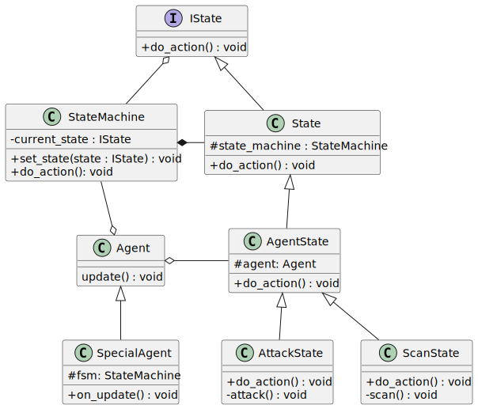
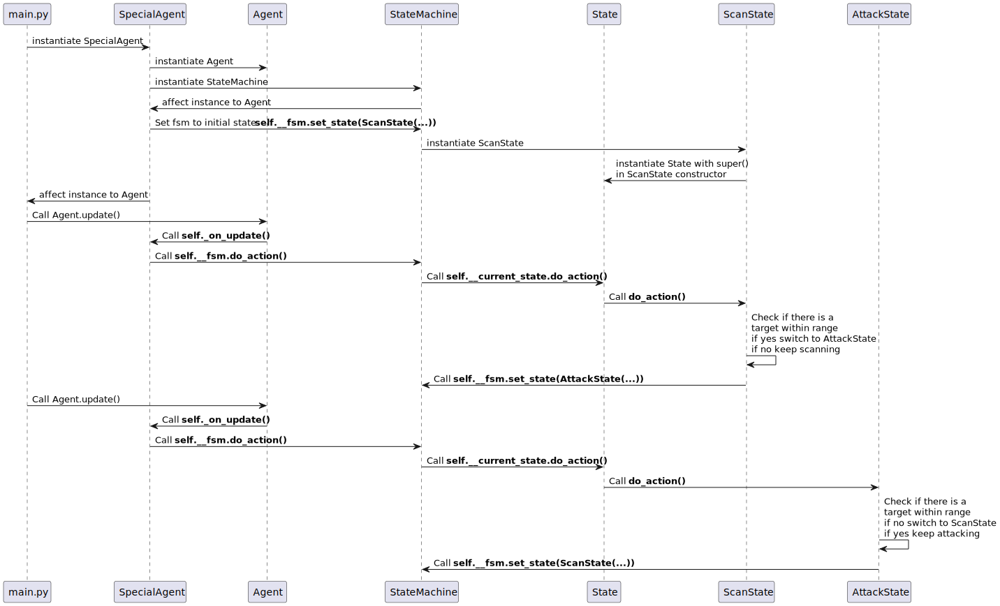

# Tactx POO - 12-02-2024

## Description

POO courses using project Tactx in Python.

## Requirements

- Python between 3.9 and 3.11
- Pip or Poetry (to install dependencies)
- Git (to clone the repository)

## Installation

1. Clone the repository

    ```bash
    git clone https://github.com/prisca-c/tactx.git
    ```

2. Install dependencies

    ```bash
    pip install -r requirements.txt
    ```

   or

    ```bash
    poetry install
    ```

3. Run the program

    ```bash
    python main.py
    ```

   or

    ```bash
    poetry run python main.py
    ```

## UML Diagram



## Sequence Diagram

